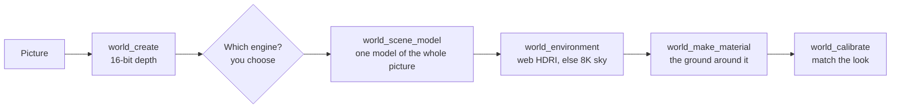

# bEpic Worlds — Usage Guide

Updated 2026-09-28

Ask agentY for a world from a picture; it builds it in ComfyUI and opens it in the bEpic viewer, where you walk it, pin notes, and have the agent act on them.

## Setup

Three pieces, all on master/main and pushed; restart ComfyUI once after pulling so the pack's routes and nodes load.

| Piece | Where | What it does |
| --- | --- | --- |
| bEpic Image Viewer | `custom_nodes/ComfyUI-ImageViewer` | Shows worlds: walk, reference overlay, Match, notes |
| ComfyUI-bEpicWorlds | `custom_nodes/ComfyUI-bEpicWorlds` | Builds and stores worlds; `/bepic_worlds/*` routes; slot workflows in `slots/` |
| agentY World Builder | `agentY` repo | Specialist the orchestrator calls with `run_world_builder` |

Check it is live: `http://127.0.0.1:8188/bepic_worlds/info` answers with JSON (a 404 means ComfyUI hasn't loaded the pack yet).

The default workflows need these models: Depth Anything V2 Large, SAM 3.1, Hunyuan3D 2.1, Z-Image Turbo, Chord + 4x-ClearRealityV1, RMBG-2.0, Wan 2.2 Fun Inpaint 14B with the lightx2v 4-step LoRAs. The World Builder uses the research/assembly model tier unless `pipeline.world_builder` is set in agentY's settings.

## Making a world

Drop the reference picture into agentY's chat and say what you want; the orchestrator hands the job to the World Builder, which runs everything in ComfyUI and opens the result in the viewer.

Things to say:

- "Make a walkable world from this photo, with the real cars in it."
- "Give the floor a proper material and add a sky."
- "Put three wooden benches along the path."
- "Make the water move."
- "Use Meshy for the cars this time." (paid API credits)
- "Build it around a TRELLIS model of the whole picture." (or Pixal3D, Hunyuan, SHARP, MoGe, Meshy, Tripo — if you don't say, the agent lists the engines and asks)

What the World Builder does, in order:

The world is built **around one 3D model of the whole picture** (item `scene`, in the World tab itself — there is no separate 3D tab). The engine is yours to choose; the agent lists them, including any other image-to-3D template in its library:

| Engine | Gives | Placed by | Cost |
| --- | --- | --- | --- |
| TRELLIS.2 | textured PBR mesh | fitting to the picture | local, 3–6 min |
| Pixal3D | TRELLIS.2 built pixel-aligned to the picture's camera | fitting | local, 3–6 min |
| Hunyuan3D 2.1 | shape, painted with the picture from the camera | fitting | local, ~2 min |
| SHARP | metric Gaussians in the camera's space, meshed with colours | the camera — exact | local, ~1 min |
| MoGe-2 | metric mesh in the camera's space, textured with the picture | the camera — exact | local, ~20 s |
| Meshy / Tripo / Rodin … | textured PBR mesh | fitting | API credits |

*Fitting* sizes the model so its tallest parts are as tall as the picture's buildings (measured by its depth), grounds it where its rim meets the ground, and turns and moves it to match the picture's own 3D. Object engines re-imagine the scene (Meshy turned a street into an L-shaped block, which the fit laid into the street's V), so the fit is loose by nature; SHARP and MoGe match the picture exactly but only hold what it shows. Either way the terrain is flattened to the model's ground and the camera stands eye-high on it. If the size is wrong, say how tall things really are ("the houses are about 12 m").

The **sky** comes from the web first: the agent reads the picture's light, searches Poly Haven's photographed HDRIs (CC0), looks at the best few against the picture and applies one — as the sky, the light and the reflections, turned so its sun stands where the world's does. Only when none fits does it generate an 8192×4096 sky.

A run takes 5–15 minutes, mostly the scene model; `world_add_objects` (SAM3 + image-to-3D per object kind, 1–2 min each) is still there for things the scene model lacks.

| Tool | Makes | Typical time |
| --- | --- | --- |
| `world_create` | The world: terrain, sky, light, the picture in 3D (hero view) | 20 s |
| `world_scene_model` | One model of the whole picture, placed, sized, grounded; hides the hero view | 1–6 min |
| `world_environment` | A matching Poly Haven HDRI (sky, light, reflections), or an 8K generated sky | 10–60 s |
| `world_add_objects` | Copies of an object in the picture, where it shows them | 1–2 min |
| `world_add_props` | Made-up objects from words, placed or scattered | 2 min |
| `world_make_material` | Tileable PBR ground or ceiling, from the picture or from words | 2 min |
| `world_make_sky` | A generated 360° sky (outdoors) | 15–90 s |
| `world_add_motion` | A looping movement of part of the picture (water, leaves, a flag) | 3–4 min |
| `world_calibrate` | Exposure, fill, sun, fog matched to the picture | 30 s, in the viewer |

## Displaying a world

Every new or edited version opens by itself in the bEpic viewer as a **World: &lt;name&gt;** tab; the tab survives reloads. To bring one back, ask the agent to open it ("open the lake world", or version 3 of it), or POST `{"name": "lake"}` to `/bepic_worlds/open`.

The tab is a previz scene: orbit it like any 3D scene, pick items in the outliner, and tweak them in the channel box. The toolbar has three world buttons:

| Button | Hotkey | Does |
| --- | --- | --- |
| Walk | Shift+J | First person at eye height; click to look, W A S D to move, Shift to run, F to pin a note, Esc to stop |
| Match | — | Matches the look to the picture by measurement and saves it as a new version |
| Note | Shift+N | Pin a note on a spot (see Reviewing) |

The world is judged best from the **Reference** camera (`refcam`): look through it and the picture lies over the view for comparison. The **hero view** is the picture itself pushed into 3D by its depth map; it looks right from near that camera and stretches as you walk away from it. Ambient motion plays on the hero view, and only while the browser tab is visible (Chrome loads no video in a hidden tab).

## Reviewing

Review by pinning notes where things are wrong, then asking the agent to work through them; each round is a new version, and nothing is ever lost.

1. Walk or orbit the world and find what's off.
2. Pin a note: press **F** while walking (at the spot you look at), or **Note** / Shift+N and click the spot. Type the note, e.g. "fewer trees here", "floor too shiny" or "a bench here". Each note keeps the spot, your view and a snapshot of what you saw, and shows as a numbered pin.
3. Tell agentY: "Look at my notes on the lake world." The World Builder reads each note, looks at its snapshot, makes one edit for the round and replies on every note it dealt with.
4. The tab refreshes to the new version; pins of resolved notes disappear, and open ones stay.

Versions: every create, edit, rebuild, match and feedback round saves a new version with a note saying what changed. To go back, ask for it ("revert the lake world to version 3"); a revert is itself a new version, so it can be undone too. Worlds live in `output/worlds/<name>/`, with every version in `versions/`.

Changes you make by hand in the channel box stay in that viewer tab only; say them to the agent (or pin them as notes) if they should reach the world.

## Changing how steps are done

Every generative step is a ComfyUI workflow ("slot"), and you can swap one by asking, e.g. "use SHARP depth" or "use Meshy for 3D"; the choice holds for all worlds until changed back.

| Slot | Default | Alternatives |
| --- | --- | --- |
| depth | Depth Anything V2, 16-bit | SHARP metric depth |
| segment | SAM 3.1 | — |
| image_to_3d | Hunyuan3D 2.1 (textured from the picture) | Meshy with PBR (API credits) |
| texture_refine | Z-Image Turbo img2img | — |
| texture_generate | Z-Image Turbo | — |
| material | 4x upscale + Chord | — |
| sky | Z-Image panorama, 4x upscaled to 8192×4096 (only when no web HDRI fits) | the same at 2048×1024; Qwen-Image 360 (needs its LoRA) |
| scene_model | TRELLIS.2 (but the agent asks you) | Pixal3D, Hunyuan3D 2.1, SHARP, MoGe, Meshy, Tripo, any image-to-3D template |
| object_image | Z-Image + RMBG-2.0 | — |
| motion | Wan 2.2 Fun Inpaint loop | — |

Any workflow can fill a slot, including one of your own or a template from agentY's library. Title its nodes `IN:image`, `IN:prompt.text`, `IN:seed.seed` … for inputs and `OUT:mesh`, `OUT:texture` … on the save nodes. The pack's own are in `ComfyUI-bEpicWorlds/slots/`, and `SCHEMA.md` there lists each slot's inputs and outputs. Textures come out tileable by default: diffusion runs through *bEpic Seamless Model* and *bEpic Seamless VAE Decode*, and a workflow of your own for a texture slot should use them too.

## Tips and current limits

- **Pictures that work best**: eye-level photos with a clear floor or ground, and objects standing on it. Aerials, close-ups and heavy wide-angle distortion build poorly.
- **HDR skies** load at 4K by default; 8K works but takes ~270 MB of graphics memory.
- **Wrong sizes** (a car 0.9 m tall) mean the camera tilt is off: ask the agent to fit the camera from the cars; this rebuilds the world, so objects and materials are added again after.
- **Rebuilds drop additions**: objects, materials, sky and motion added since are not carried over, so the agent rebuilds first and adds after.
- **Generated objects** only know the side the picture shows; their far side is a colour blur. Meshy gives fully textured objects, at a cost.
- **Procedural vegetation** (the trees and rocks the builder scatters) is stylised low-poly; for real-looking trees, ask for props ("scatter 20 pine trees like the ones in the picture").
- **Match** needs the world open in a visible browser tab; the agent's calibrate step waits for it.
- **Not yet here**: the Qwen 360 sky LoRA isn't downloaded, and a world can only be built from one picture at a time.
